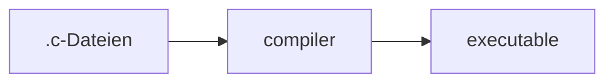

# C

* Kompilierte Sprache



```bash
# compile
$ gcc -o getting_started main.c
# run
$ ./getting_started
```

---

## Grundstruktur

```C
// Kommentare
/*
Auch im Block/über mehrere Zeilen möglich
*/

// includes
#include <stdio.h> // für z.B. printf()

// execution starts at main()
int main(void) // Funktion
{ // {} umfassen mehrere Anweisungen zu einem Block
    printf("%s\n", "Hallo Welt"); // Funktionsaufruf, der ";" beendet die Anweisung
}
```

Referenz zur Ausgabe (am Terminal): https://en.cppreference.com/w/c/io/fprintf


---

## Anweisungen und Ausdrücke

* Anweisung (statement)
  * Kann als Block zusammengefasst werden
* Ausdruck (expression)

----

### Ausdruck

Kombination aus _Operatoren_ und _Operanden_. Kann ausgewertet werden und dabei einen Wert ergeben.

Beispiele
```C
4+5
a<b
42
(23-2)*2
```


----

### Anweisung

Mit `;` abgeschlossen (oder mit `{}` zu einem Block zusammengefasst).

```C
c = 1 + 2;
```

Die Zusweisung `c = 1 + 2` ist auch ein Ausdruck (mit dem Wert 3).

---

## TODO: Datentypen (eingebaut)

Ganzzahlen
Fließkommazahlen
Zeichen
Zeichenketten
