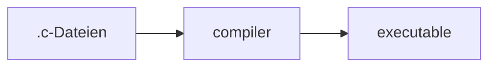

# C


## Kompilierte Sprache



```bash
# compile
$ gcc -o getting_started main.c
# run
$ ./getting_started
```


## Grundstruktur

```C
// Kommentare
/*
Auch im Block/über mehrere Zeilen möglich
*/

// includes
#include <stdio.h> // für z.B. printf()

// execution starts at main()
int main(void) // Funktion
{ // {} umfassen mehrere Anweisungen zu einem Block
    printf("%s\n", "Hallo Welt"); // Funktionsaufruf, der ";" beendet die Anweisung
}
```

Referenz zur Ausgabe (am Terminal): https://en.cppreference.com/w/c/io/fprintf


## Anweisungen und Ausdrücke

* Anweisung (statement)
  * Kann als Block zusammengefasst werden
* Ausdruck (expression)


### Anweisung (statement)

Mit `;` abgeschlossen, oder mehrere mit `{}` zu einer Block-Anweisung zusammengefasst.

```C
c = 1 + 2;
; // leere Anweisung
```

Die Zuweisung `c = 1 + 2` ist auch ein Ausdruck (mit dem Wert 3).

https://en.cppreference.com/w/c/language/statements


### Ausdruck (expression)

Kombination aus _Operatoren_ und _Operanden_. Kann ausgewertet werden und dabei einen Wert ergeben.

Beispiele
```C
4+5
a<b
42
(23-2)*2
```

https://en.cppreference.com/w/c/language/expressions


## Operatoren

* Arithmetische Operatoren 
* Inkrement/Dekrement
* Zuweisungen
* Logik
* Vergleich
* Zugriff
* Andere


### Arithmetische Operatoren

* Summe `+`, Differenz oder Vorzeichenumkehr `-`, Produkt `*`, Quotient `/`, Rest `%`
* Bitweise: NICHT (Komplement) `~`, UND `&`, ODER `|`, XOR `^`, Shift-Operator `<<` bzw. `>>`

Die Operator-Rangfolge ist mathematisch sinnvoll (Punkt vor Strich).
Dennoch immer empfehlenswert: Klammern setzen!
Notiz: [iso646.h bei cppreference.com](https://en.cppreference.com/w/c/language/operator_alternative)
Siehe auch: https://en.cppreference.com/w/c/language/operator_arithmetic


### Inkrement/Dekrement

* Prefix: `++a` bzw. `--a`
* Postfix: `a++` bzw. `a--`

Nicht mehrmals in einem Ausdruck verwenden!
https://en.cppreference.com/w/c/language/operator_incdec


### Zuweisung

* `=`, von rechts nach links
* und Kombinationen mit allen arithmetischen Operatoren: `+=` etc.
  * `a += 2` entspricht `a = a + 2`

https://en.cppreference.com/w/c/language/operator_assignment


### Logische Operatoren

Nicht mit den bitweisen Operatoren verwechseln!

* Nicht: `!`
* UND: `&&`
* ODER: `||`

Logisch falsch: 0
Logisch wahr: von 0 verschieden
Notiz: iso646.h


### Vergleiche

* Gleichheit `==`, Ungleichheit `!=`
* Kleiner `<`, Kleiner gleich `<=`
* Größer `>`, Größer gleich `>=`

Achtung: `=` und `==` nicht verwechseln!

https://en.cppreference.com/w/c/language/operator_comparison


### Zugriff

`&`, `*`, `[]`, `.` und `->`
 
https://en.cppreference.com/w/c/language/operator_member_access


### Andere Operatoren

* `sizeof(typ)` und andere
  * `sizeof` ergibt die Anzahl der notwendigen Bytes
* https://en.cppreference.com/w/c/language/operator_other


## Variablen

```C
int baz = 23; // baz ist eine ganze Zahl, ab hier 23
```

* Variablen sind ein Name für Platz im Speicher
* Der Typ definiert wie viel Platz benötigt wird
  * `int` ist meistens 4 Bytes (32 bits) groß
* Der Typ definiert wie der Platz zu interpretieren ist
  * Man kann den Speicher bei Bedarf auch anders interpretieren (cast)


## Deklaration, Definition, Initialisierung

```C
extern int foo; // Deklaration
int bar; // Definition
int baz = 23; // Initialisierung
```


### Deklaration

```C
extern int foo; // Deklaration
// Ab hier ist foo bekannt (und hat einen Datentyp)
```

* Reserviert keinen Speicherplatz.
* Legt nur Typ und Namen fest.
* Kann wiederholt vorkommen.

https://en.cppreference.com/w/c/language/declarations


### Definition

```C
int bar; // Definition
```

* Reserviert auch den Speicherplatz
  * Bei Funktionen den Inhalt (kommt später)


### Initialisierung

```C
int baz = 23; // Initialisierung
```

* Bestimmt den (ersten) Inhalt
  * Vorher ist der Inhalt (meist) nicht bekannt.
* Variablen bei der Definition _immer_ initialisieren!


## Basisdatentypen

* Bool'sche Werte
* Ganze Zahlen
* Fließkommazahlen
* Zeichen
  * Zeichenketten


## Exkurs: Zahlensysteme

* Wir verwenden üblicherweise _Stellenwertsysteme_
* siehe: https://de.wikipedia.org/wiki/Stellenwertsystem


### Stellenwertsysteme

* Im Dezimalsystem (Basis $b = 10$): Einer, Zehner, Hunderter, ...
  * Geschrieben in umgekehrter Reihenfolge
*  $123 = 1 \cdot 10^2 + 2 \cdot 10 + 3 \cdot 1$
* $Z = a_2 \cdot b^2 + a_1 \cdot b^1 + a_0 \cdot b^0$


### Allgemeiner Fall

* Für $N$ Stellen: $Z = \sum_{i=0}^{N-1} a_i \cdot b^i$
* Anzahl an darstellbaren Werten: $b^N$
* Zahlenbereich: $0 \dots b^N - 1$


### Binärsystem

* PCs rechnen im Binärsystem ($b=2$)
* Platz ist endlich, z.B. 1 Byte = 8 bit
  * $ Z = \sum_{i=0}^{7} a_i \cdot b^i$
  * 256 Werte: 0...255
* Darstellung am Bildschirm/im Code ist länglich
  * Andere Basis für die Darstellung notwendig
  * Seit C23 mit `0b`-Präfix möglich


### Oktalsystem

* Basis $b = 8$ (3 bit)
* Historisch wichtig
* Mit `0` als Präfix
  * Achtung Stolperfalle führende Null bei Dezimalzahlen!
  * `010` ist 8, nicht 10!
* Demo: `ping`-Kommando 


### Hexadezimalsystem

* Basis $b = 16$ (4 bit, ein halbes Byte, 1 nibble)
* Symbole 0...9, A...F (a...f) mit Werten 0...15
* Genutzt wenn
  * die binäre Darstellung eine Rolle spielt
  * die Darstellung als Text unabhängig vom Wert gleich lang sein soll
* Mit `0x` oder `0X` als Präfix
* Demo: git commit numbers


### Beispiele

* `64` ist auch `0100` oder `0x40`
  * und ggf. `0b1000000`
* `127` ist auch `0177` oder `0x7f` bzw. `0x7F`
  * und ggf. `0b1111111`
* `0x1F` ist $1 \cdot 16 + 15 \cdot 1 = 31$


## Basisdatentypen für Zahlen

* Bool'sche Werte
* Ganze Zahlen
  * mit und ohne Vorzeichen
* Fließkommazahlen
  * unterschiedliches Fassungsvermögen


### Bool'sche Werte

```C
#include <stdbool.h>
bool a = true;
```

* Wahr oder Falsch
* Zwei Literale
  * `true` oder `false`
* eigentlich ganze Zahlen
  * `false` ist 0, alle anderen Werte sind _nicht_ `false` (`true` ist nur _einer von vielen_)
  * Niemals auf Gleichheit mit `true` prüfen!


### Ganze Zahlen

* mit Vorzeichen
  * optionales `signed` vor dem Datentyp, der Default
* ohne Vorzeichen
  * `unsigned` vor dem Datentyp
* Literale
  * Wenn man einen konkreten Wert im Code angeben möchte
  * z.B. bei der Initialisierung


### Ganze Zahlen: unbestimmtes Fassungsvermögen

```C
char a = 96;               // mind. 8 bit, sizeof(char) ≥ 1
short int b; short c = 42; // mind. 16  bit
int d = 23;                // mind. 16 bit
long int e; long f = 5L    // mind. 32 bit
long long int g; long long h = 7LL; // mind. 64 bit
unsigned char i; // etc. wie oben, aber nur pos. Zahlen
``` 
https://en.cppreference.com/w/c/language/arithmetic_types


### Ganze Zahlen: definiertes Fassungsvermögen

```C
#include <stdint.h>
int8_t a; int16_t b; int32_t c; int64_t d; // exakt 8, ... bits
int_fast8_t e; // mindestens 8 bit, die schnellste Variante
int_least8_t f; // mindestens 8 bit, die kleinste Variante
uint8_t g; // etc. wie oben, aber nur pos. Zahlen
``` 
https://en.cppreference.com/w/c/types/integer


### Wertebereichsgrenzen

```C
#include <limits.h>
long a = LONG_MAX; // je nach Compiler und Platform
long b = LONG_MIN; // je nach Compiler und Platform
unsigned long c = ULONG_MAX; // je nach Compiler und Platform
// etc.
```
https://en.cppreference.com/w/c/types/limits


### Fließkommazahlen

* `float`
* `double`
* Literale
* TODO


## Exkurs: Zeichen-Codierung

* ASCII
* Unicode
  * UTF-8
  * UTF-16
  * UTF-32
* TODO


## Basisdatentypen für Zeichen

* `char`
* `wchar`
* Literale
* TODO


## Ein- und Ausgabe
```C
#include <stdio.h>
```
* TODO


## Quellen

* [cppreference.com](https://en.cppreference.com/w/c)
* [C17/C18 final draft](https://files.lhmouse.com/standards/ISO%20C%20N2176.pdf)
* [Wikibooks: C Programmierung](https://de.wikibooks.org/wiki/C-Programmierung)
