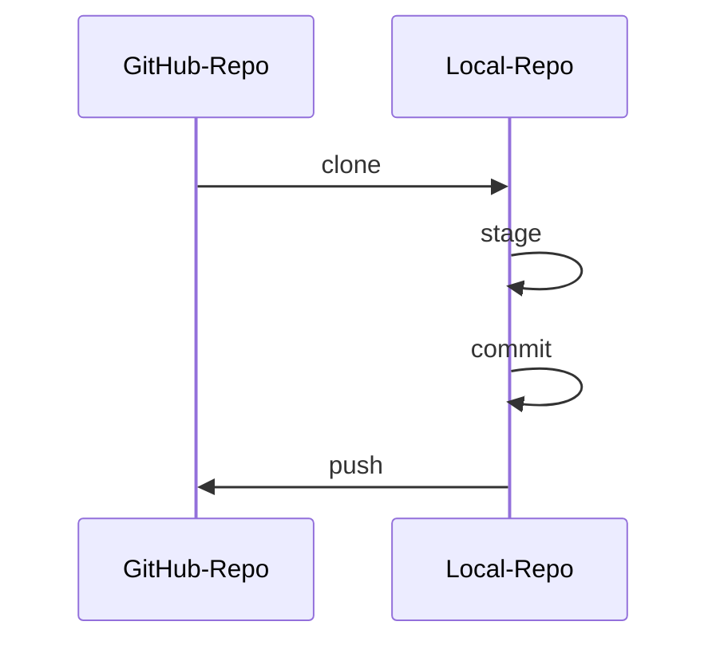
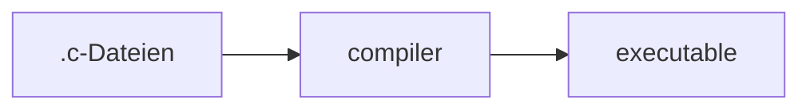

# FI 1BHET 2024/25: WU's Notizen


## Git/GitHub

https://git-scm.com/doc

`git` ist eine Versionskontroll-Software


### Remotes



## C

* Kompilierte Sprache



```bash
# compile
$ gcc -o getting_started main.c
# run
$ ./getting_started
```

### Grundstruktur

```C
// Kommentare
/*
Auch im Block/über mehrere Zeilen möglich
*/

// includes
#include <stdio.h> // für z.B. printf()

// execution starts at main()
int main(void) // Funktion
{ // {} umfassen mehrere Anweisungen zu einem Block
    printf("%s\n", "Hallo Welt"); // Funktionsaufruf, der ";" beendet die Anweisung
}
```

#### Ausgabe (am Terminal)

https://en.cppreference.com/w/c/io/fprintf

#### TODO: Datentypen (eingebaut)

Ganzzahlen
Fließkommazahlen
Zeichen
Zeichenketten


